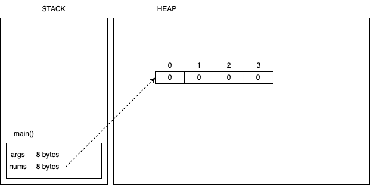
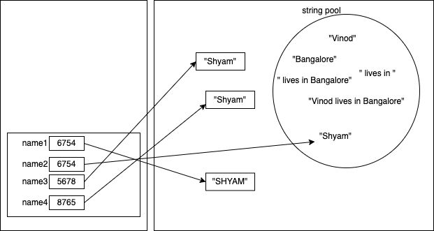

# Day2

## Variables and Data types

-   In java you must declare a variable before its use
-   A variable must have a data type
-   A variable's data type can be of
    1. Primitive type
        - Predefined data types by the language
        - The name and size of the variable's type (keywords)
        - 4 categories
            1. Integers
                1. byte (1 byte or 8 bits of space in memory)
                1. short (2 bytes or 16 bits)
                1. int (4 bytes or 32 bits)
                1. long (8 bytes or 64 bits)
                - Integers are stored in binary format. For example, the number `65` in binary is `01000001`.
                - All integer types are `signed` by default
                - The leading bit out of the allotted bytes represents the sign (0 for + and 1 for -)
                - For example, in a byte there are 8 bits and 1 bit is used for sign, and hence the actual value is stored in the remaining 7 bits. The maximum value that can be stored is (2^7)-1 and the smallest value that can be stored in a byte is -2^7
            2. Real numbers
                1. float (4 bytes or 32 bits)
                1. double (8 bytes or 64 bits)
            3. Characters
                1. char (2 bytes or 16 bits, stores UNICODE characters)
            4. Logical
                1. boolean (1 bit stores a representation of `true` and `false`)
    1. Reference type
        - Any data type other than primitives
        - class, interface, enum, annotation, record
        - Variables of an array type
        - The size is fixed (4 bytes in a 32 bit env, 8 bytes in a 64 bit env)

### Naming convention for variables (or identifiers in general)

-   Identifier can be name of - variable, method/function, class, interface, enum, package, annotation, record
-   For class, interface, enum, annotation, record
    -   PascalCase
    -   First letter of each word is in uppercase, and the rest of the letters in each word are in lowercase
        -   ArrayIndexOutOfBoundsException
        -   StringDemo
-   For methods, variables
    -   camelCase
    -   first word is in lowercase and the rest of the words are in PascalCase
    -   main()
    -   toString()
    -   calcualteNetSalaryForOnrollEmployee()
-   For packages
    -   lowercase words delimited with dot
    -   com.targetindia.programs
-   We do not recommend the use of underscore or block letters in variables (there are exceptions)

## Operators

1. Arithmetic
    - unary
        - `+ - ++ --`
    - binary
        - `+ - * / % = += -= *= /= %=`
    - ternary
        - `?:`
        - `expr1 ? expr2 : expr3`
        - expr1 must be evaluated to `true` or `false`
1. Relational
    - `< <= > >= == !=`
1. Logical
    - Logical AND `&&`
    - Logical OR `||`
    - Logical NOT `!`
1. Bitwise
    - Self learning

## Control structures

-   Keywords in Java that can change the flow of control (execution)
-   Selection statements
    -   if/else
    -   switch/case
-   Iteration (aka loops)
    -   while
    -   do/while
    -   for

