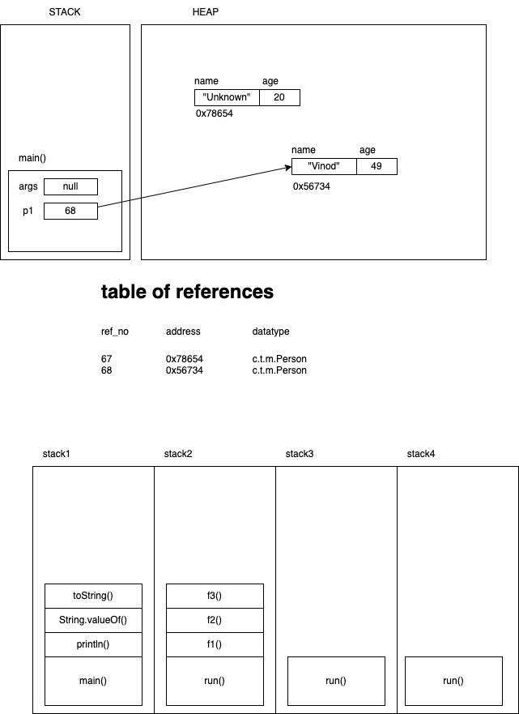

## Programming Paradigms

-   Procedure oriented
    -   Procedure = subprogram = module = subroutine = function
-   Object oriented
    -   Contributions from Grady Booch
    -   Book - Object Oriented Analysis and Design
    -   4 Major elements and 3 Minor elements
        -   Major elements: Abstraction, Encapsulation, Modularity, Hierarchy
        -   Minor elements: Persistence, Concurrency, Typing

### Abstraction

-   Hiding the implementation details
-   "Car" is an abstraction and hides the implementation details as what actually makes up a car
-   In Java, you achieve this by creating a `class`
-   A class is a template for creating (instantiating) an object

```java
// create a class
class Person {
    // implementation details
}

// create an object
Person p1 = new Person();
```

### Encapsulation

-   Shielding members of an object from outside access

```java
class Person {
    public String name;
    private int age; // int ranges from -2^31 to (2^31)-1

    public void setAge(int age) {
        if(age<1 || age>130) {
            // report an error to the user and cancel this operation
            throw new RuntimeException("Invalid value for age ("+age+")");
        }
        this.age = age;
    }
}

Person p1 = new Person();
p1.name = "Vinod"; // allowed
p1.age = 49; // not allowed
p1.setAge(49); // allowed
```

### Constructor?

```java

public class Person {

    public Person(){
    }
}

```



-   A function like construct in a class
-   Has the same name as the classname
-   No return type can be mentioned; not even `void`
-   Unlike other member functios, you cannot call the constructor using the object
    -   `p1.setAge(40);` // allowed
    -   `p1.Person();` // not allowed
-   It is automatically invoked when you create an object
    -   `Person p1 = new Person();`
-   If the class doesn't have a constructor, one will be given by the compiler
    -   This constructor does not take parameter
    -   Hence it is also called as no-arg constructor
    -   Since it exists by default in the class, it is called as default constructor
    -   However, if the class has any kind of constructor, then compiler does not provide the default constructor

## Hierarchy


-   Focus on code reusability
-   Arrangement of classes
    -   Aggregation (HAS-A) - Department has Employees
        -   A Whole-Part relationship
        -   Composition (a stronger form of aggregation) - Computer HAS-A Processor
    -   Inheritance (IS-A) - Laptop IS-A Computer
        -   Parent-Child relationship
    -   Association (USES-A) - Person USES-A Phone


