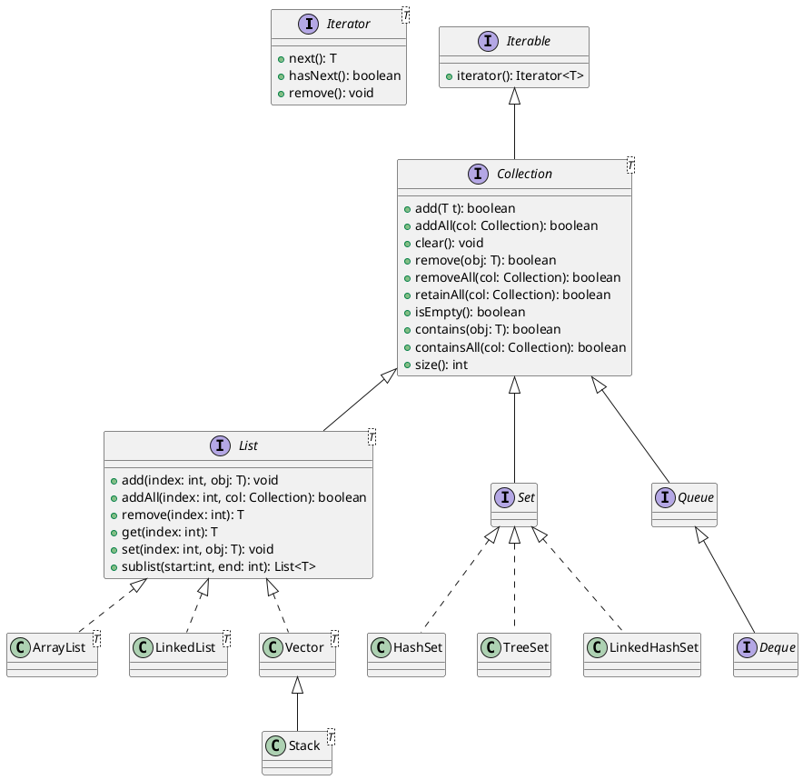

# Collection framework in Java

## Limitations of using an array and the need of a new type called Collection

- Arrays are created in the heap, the size of which can be determined during the runtime (unlike C language)
- Once array is created of a particular size, you cannot increase or decrease the size
- An array occupies bytes continuously in the RAM, and sometimes, if the array size is huge, we may not get enough memory
- insertion and deletion operations on an array element/s is time consuming (arrays do not provide any built in mechanisms)

### Collections in Java

- Introduced in JDK 1.0
- Lots of things changed in version 1.2
- Java 5 brought in the feature of generics (homogeneous collection)
- Java 8 brought in the feature of streams (a stream of data)
- Java collection framework is a bunch of interfaces and many implementing classes
  - choose an implementation based on your requirement and optimization

### List implementations

1. ArrayList
   - introduced in version 1.2
   - internal mechanism is an array
   - default size of the internal array is 10
   - every time we add an element, the capacity is ensured
   - insertion and deletion operations are time consuming
   - since arrays are faster (random access), this should be the default choice for `List` type
1. LinkedList
   - uses a linked list to store data
   - elements are not contiguous
   - each element has a reference to the next and previous element
   - insertion and deletion operations are faster
   - if there is a lot of performance loss due to heavy insertion and deletion operations, then choose this class for an object of `List` type
1. Vector
   - internal mechanism is an array, just like an ArrayList
   - was introduced in version 1.0 (hence a.k.a. legacy collection)
   - went through lot changes in version 1.2 (and in version 1.5) and was aligned with the new collection framework
   - most of the methods are synchronized (data safety is ensured in a multithreaded application)
     - additional overhead involved
   - use this class only if your data in the collection is shared to multiple threads
1. Stack

## Implementation of Set

- A set has no additional methods (apart from the ones introduced after Java 8, stream related)
- An object of a Set is a collection that does not allow duplicate values

The most common implementations include:

1. HashSet

   - internally uses a class called HashMap, which is a key/value pair collection, which internally uses an array called buckets
   - because it uses arrays, they are generally faster than other Set implementations
   - To ensure that there are not duplicates in the set, it uses the element's equals() and hashCode() methods
     - for example, if e1 and e2 are two elements, then
       - e1.equals(e2) == false and
       - e1.hashCode() != e2.hashCode()
   - Does not guarantee the order of insertion to be same order of retrieval

1. TreeSet

   - internally uses a class called TreeMap, which is a key/value pair collection, which internally uses a Red-Black tree, a specialized form of BST (binary search tree)
   - The order of insertion can be anything, but order of retrieval is in ascending order of elements
   - Here two elements's natural order is determined using a function called `compareTo`, which is forced upon a class by an interface called `java.lang.Comparable`
     - In other words, the element's type must implement the Comparable interface.
   - It is important to notice that this class does not depend on the `equals` and `hashCode` methods of the elements added.

1. LinkedHashSet

   - internal implementation uses a class called LinkedHashMap, which internally uses the linked list for storing multiple values
   - uses the `hashCode` and `equals` to ensure that there are no duplicates.
   - the order of insertion and retrieval are same.
