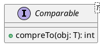

# Set and implementations

- HashSet and LinkedHashSet use `hashCode()` and `equals()` to check if the new object to be added to the set is a duplicate or not
- TreeSet does not depend on `hashCode()` and `equals()`
  - instead, it expects the objects being added to the set to implement `java.lang.Comparable`, so that one object can be compared to another using the `compareTo()` method



For example,

```java
public class Product implements Comparable<Product> {
    // members of Product

    @Override
    public int compareTo(Product other) {
        return ....
    }
}

Product p1, p2;
// initialize p1 and p2 here
int result = p1.compareTo(p2);

```

- The return value is either negative, zero or positive
  - negative means p1 < p2
  - zero means p1 == p2
  - positive means p1 > p2

## Functional Programming

- a function is a first-class object
- a function object can be passed to another function as parameters/arguments
- a function object can be returned from another function
- Until Java 1.7 (including), we can pass only primitives and references of objects to a function
- Java 8 introduced:
  1. functional interface
     - an interface which consists of exactly ONE abstract method
     - optionally has an annotation @FunctionalInterface
  1. lambda expression (arrow function)
     - can only represent the abstract method of a functional interface
  1. Streams API
- We can pass lambda expressions (which are nothing but functions) to a function as parameters or return from a function as a return value
  - thereby enabling Java with functional programming

For example,

```java
Comparator<Employee> esc = (e1, e2) -> e1.getSalary() < e2.getSalary() ? -1 : 1;
```

- RHS is a simplified version of the anonymous object
- Here we just write the `(parameter_list) -> return_value`, which is the implementation of the only abstract function of the interface on the LHS (which in this case is Comparator)
- During compilation, Java compiler creates an anonymous object for the given arrow function and then passes the same

## Utility classes `java.util.Arrays` and `java.util.Collections`

- provide lots of useful static methods to work with arrays and collections respectively
  - For example, sorting, searching, converting to String etc
