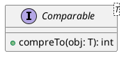

# Set and implementations

- HashSet and LinkedHashSet use `hashCode()` and `equals()` to check if the new object to be added to the set is a duplicate or not
- TreeSet does not depend on `hashCode()` and `equals()`
  - instead, it expects the objects being added to the set to implement `java.lang.Comparable`, so that one object can be compared to another using the `compareTo()` method




For example,

```java
public class Product implements Comparable<Product> {
    // members of Product

    @Override
    public int compareTo(Product other) {
        return ....
    }
}

Product p1, p2;
// initialize p1 and p2 here
int result = p1.compareTo(p2);

```

- The return value is either negative, zero or positive
    - negative means p1 < p2
    - zero means p1 == p2
    - positive means p1 > p2