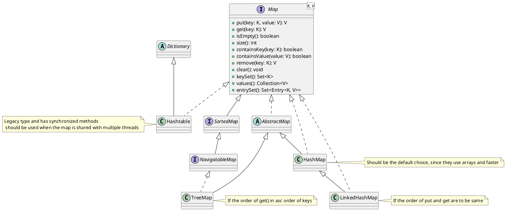
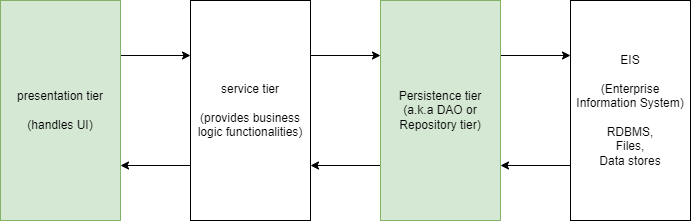

# Map

- is a collection of key/value pairs
- You may consider the "key" is the index for accessing an element inside a Map
- "key" is expected to be a unique value
  - For example, in order to store and quickly access objects of Employee type, we may use the employeeId or email or phone etc. as the key

An illustration of Hashtable from Wikipedia:

