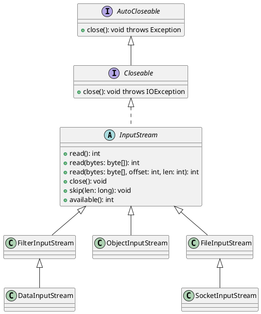

# Java IO Streams

- Allows us to read from a source of data or write to a target of data
- InputStream 
    - an abstract class that provides most of the functionalities (low level) that can be performed on a source of data
    - 

