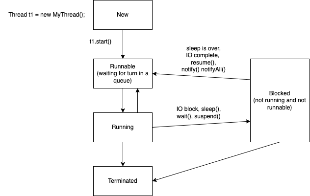

# Multithreading

- a thread is a lightweight process
- occupies the same address space as the program which is running the thread
- communication and sharing of data between threads is easy (compared to the same between two processes)
- when a java app is run, the JVM (JRE) executes many threads (as many as 15+) and one of them is called "main"
  - this is responsible for calling the `public static void main(String[]args)` method
  - whenever there is an exception thrown from any part of your application, and not handled, the "main" thread catches the same, and breaks execution of the program.
  - all other threads also will stop the execution
- in java, a thread object has a special method called `public void run()`, which actually contains the code being executed when the thread is under execution.
  - once the code in the `run()` method is finished, the thread is considered to be a dead thread.

### Lifecycle (status) of a thread

- `new`: the thread is just created. it is part of your memory, but hasn't been given to the CPU scheduler yet.
- `runnable`: now the scheduler is aware of this thread, and simply places this at the end of the thread queue
- `running`: when the CPU actually runs your thread
- `blocked`: for example, when there is a user input required, the thread is in the blocked state. also, a deliberate delay (Thread.sleep(duration) is one such example).
- `terminated`: the run() method finished its job.

### Creating a thread object

- an object of `java.lang.Thread` or one of it's subclasses
- the subclass generally should override/implement the `public void run()` method
  - this is the code being executed when the thread is in the `running` state
- alternately, we can supply the body of the `run()` method to the Thread constructor itself.
  - we do it by supplying an object of a class that implements `java.lang.Runnable` interface
  - Runnable is a functional interface, which means, we can supply an arrow function to the Thread constructor - arrow function are preferred when we have one line of code for the arrow function
