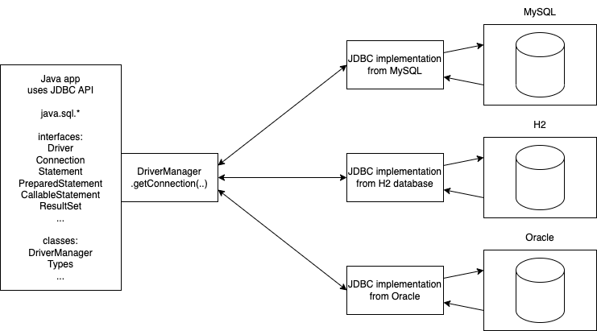

# Introduction to SQL and JDBC

### What is a database?

- collection of related (to a specific mini-world) data
  - data is a piece of information
- mini world is a subsystem of real world
  - for example, an organization or a part of an organization
- a database is an implementation of a data model

### Data models

- Relational
  - "Relation" is nothing but a "Table"
  - data is perceived as rows and columns of a table
- Hierarchical
  - tree like structure
  - tree of records
- Network
  - records may have references to other records
  - graph like structure
- NOSQL
  - document based (Mongodb)
  - key/value pair based (Redis)

### SQL

- structured query language
- a language model used for communicating with RDBMS
- standardized by ANSI
  - different RDBMS vendors provide different additions to SQL
- most popular RDBMS softwares:
  - Oracle
  - PostgreSQL
  - MySQL (created by Sun microsystem, later acquired by Oracle)
  - H2 (popularly used for setting up test databases, in memory)
  - MS-SQL server (a.k.a sequel server, from Microsoft)
  - DB2 (from IBM)
  - SQLite
  - MS-Access (optional part of MS-office suite)
- Commands can be broadly divided into
  - DDL (Data Definition Language)
    - CREATE, ALTER, DROP
  - DML (Data Manipulation Language)
    - INSERT, UPDATE, DELETE
  - Query
    - SELECT

## Setting up H2 database server:

1. create a new maven java project in IntelliJ IDEA
1. add the following dependency
   ```xml
       <dependency>
           <groupId>com.h2database</groupId>
           <artifactId>h2</artifactId>
           <version>1.4.197</version>
       </dependency>
   ```
   This will download the specified version of the JAR into the following directory:
   /Users/vinod/.m2/repository/com/h2database/h2/1.4.197
1. double click the JAR file to run a server java program and a web application, which automatically opens in http://localhost:8082
1. alternately, you can run the jar file directly at a command prompt (terminal)
   ```sh
   java -jar /Users/vinod/.m2/repository/com/h2database/h2/1.4.197/h2-1.4.197.jar
   ```
1. If the browser is closed, you can always open `http://localhost:8082`
1. If you want to run SQL commands from a file, from the H2 client console, issue this command:
   `runscript from '/Users/vinod/Documents/TARGET-APR-2023-BATCH-2/day-17/customers.sql'`

Troubleshooting:

1. if any other version of h2 server is running, and you are not able to access the database,
   - run the `jps` command to find out the PID of the server
   - (windows) using the task manager, end the specific task
   - (mac/linux) use the `sudo kill -9 {pid}` to kill the specific process
1. if you have forgotten the password, we cannot recover
   - delete a file with {dbname}.mv.db found in the home directory (/Users/vinod)

## Short and quick overview of SQL DDL and DML commands:

### CREATE command

- used for creating **table**, view, index, user etc (mostly any database objects)

Syntax:

```sql
CREATE TABLE {tablename} (
    {column1} {column1_definition}
    [, more column definitions]
)
```

where column1_definition is:

```sql
    {datatype}[size]
        [PRIMARY KEY]
        [NOT NULL]
        [DEFAULT {default_value}]
        [UNIQUE]
        [CHECK ({condition})]
        [REFERENCES {another_table}({unique_column_name})]
```

For example, let's create a `customers` table consisting of few details about customer:

```sql

CREATE TABLE customers (
    id int PRIMARY KEY auto_increment,
    first_name varchar(20) not null,
    last_name varchar(20),
    gender varchar(6) check (gender in ('Male', 'Female')),
    city varchar(25) default 'Bangalore',
    phone varchar(20) unique,
    email varchar(100) unique
);

```

### INSERTing a new row

Syntax:

```sql
INSERT INTO {tablename} [{column_list}]
    VALUES ({value_list})
```

For example,

```sql
INSERT INTO customers values
    (null, 'Vinod', 'Kumar', 'Male', 'Bangalore', '9731424784', 'vinod@vinod.co');

INSERT INTO customers (first_name, gender)
    VALUES ('Kishore', 'Male');

INSERT INTO customers (first_name, gender) VALUES
    ('Kiran', 'Male'),
    ('Usha', 'Female'),
    ('Naveen', 'Male'),
    ('Rajesh', 'Male');

```

### UPDATing existing row/s

Syntax:

```sql
UPDATE {tablename}
    SET {column1=value1}
    [, more columns/values]
    [WHERE {condition}]
```

Examples:

```sql
UPDATE customers SET last_name='Rao'; -- updates all rows

UPDATE customers SET last_name='Kumar' WHERE id in (1, 5, 6);

UPDATE customers SET last_name=NULL WHERE id=4;

UPDATE customers SET city='Vasco' WHERE first_name like 'Ki%';

-- error; email already present
UPDATE customers SET email='vinod@vinod.co' WHERE id=5;
```

# JDBC

- acronym for Java Database Connectivity
- set of interfaces and few classes
- a common API for connecting and working with any RDBMS
- uses the `factory method` design pattern



- A driver object is automatically registered with `DriverManager` just being in the CLASSPATH
  - for example, if the dependencies are found i pom.xml
- we can check the list of available drivers using the `DriverManager.drivers()` method, that gives a `Stream` of `java.sql.Driver` objects. For example,
  - org.h2.Driver
  - com.mysql.cj.jdbc.Driver
  - org.postgresql.Driver
  - com.microsoft.sqlserver.jdbc.SQLServerDriver
  - oracle.jdbc.OracleDriver
- To connect to a particular database, we need the corresponding driver
- The driver object knows how to create a connection
- For getting a new Connection object to a database, we use `DriverManager.getConnection(..)` which in turn, uses the `connect(..)` method of the suitable Driver, based on the discriminator supplied

For example,

```java
// String url = "jdbc:mysql://localhost:3306/testdb"; // discriminator
// String url = "jdbc:posgresql://localhost:5432/testdb"; // discriminator
// String url = "jdbc:mssql://localhost:1443/testdb"; // discriminator
// String url = "jdbc:oracle:thin:@localhost:1521/orcl"; // discriminator
String url = "jdbc:h2:tcp://localhost/~/testdb"; // discriminator
String username = "root";
String password = "Welcome#123";

Connection conn = DriverManager.getConnection(url, username, password);
```


Inside the getConnection() of DriverManager something like this is done:

```java
Enumeration<Driver> drivers = getDrivers();
while(drivers.hasMoreElements()){
    Driver d = drivers.nextElement();
    if(d.accepts(url)){
        return d.connect(url);
    }
}
throw new SQLException("No suitable driver");
```