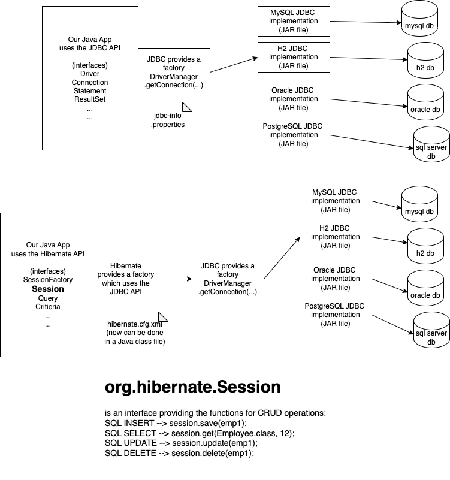

# ORM - Object Relation Mapper

- tool/ framework for mapping Objects (in programming language) to a Relation (table in a RDBMS)
- the framework will take care of
  - performing CRUD operations
  - executing Queries and getting a collection of language specific domain objects
- the first ORM framework is often credited to Smalltalk based framework called GemStone, developed in 1980s
- work with objects instead of SQL commands (in your Java application)
- after a very long time, Entity beans in EJB (a Java way of creating enterprise applications) became the first ORM implementation for Java
  - some drawbacks in EJB's ORM:
    - the application must be run on an enterprise server
    - very complex architecture
    - very limited query features
- To overcome the downside of EJB's ORM, `Gavin King` of Redhat, created a simpler version of the same, where even stand-alone java projects can make use this ORM.

  - Plain objects are mapped to Relations (tables) using an XML file
  - Java 5 introduced annotations, and Hibernate also replaced XML configuration using annotation based configuration

  ```java
  @Entity
  @Table(name="employees")
  public class Employee {
      @Id
      @Column(name="emp_id")
      private Integer id;
      private String name;
      private Double salary;
      ....
  }
  ```

- Official EJB framework went through lot of changes and adopted the concepts from
  - Hibernate (ORM concept)
  - Spring framework (IOC, DI)
- EJB 2.x had
  - Session Beans (Stateless and Stateful beans)
  - Entity Beans
  - Message driven Beans
- EJB 3.x removed the concept of entity beans from EJB spec
  - Stateless beans
  - Stateful beans
  - Message drive beans
- EJB's entity beans became a separate project, that does not need EJB servers
  - new API called JPA (Java Persistence API)
  - a set of interfaces and standard annotations
  - can have different implementations
    - Hibernate
    - Apache Open JPA
    - Eclipselink from Eclipse
    - Toplink from Oracle


