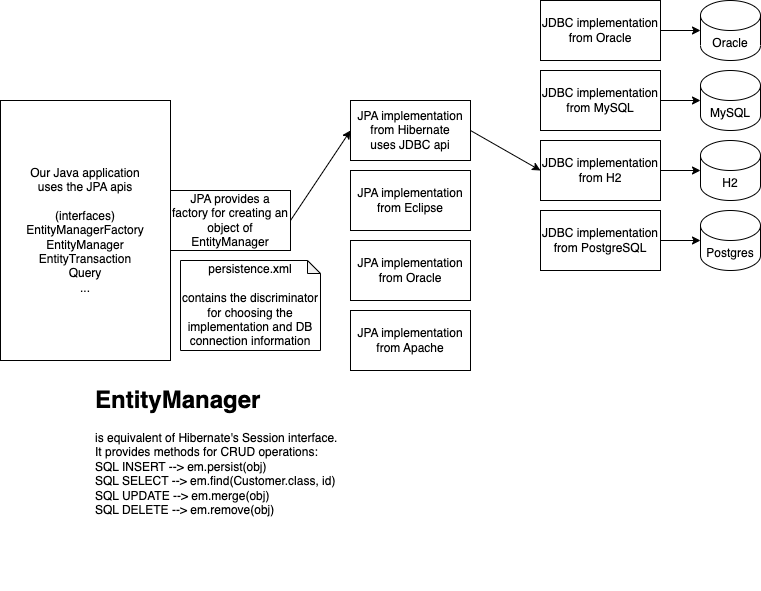

# JPA - Java Persistence API

- In EJB 2.x the ORM was implemented via Entity beans
- Because of the simplicity provided by Hibernate ORM, JCP revamped the EJB standards and replaced the Entity beans with a new API called JPA
- Unlike the older entity beans, JPA can be used in a standalone project also
  - entity beans required to be run on application servers
- JPA is a set of interfaces, standardizing the way of working with RDBMS in a Java app.
- JPA is implemented by many vendors
  - Hibernate
  - Eclipselink from Eclipse
  - OpenJPA from Apache (not updated to version JPA 3.x)
  - Toplink from Oracle (not maintained anymore)
- This means, if we use JPA instead of Hibernate API (Session, Query, etc), we get to choose from a variety of implementation
  - while if we use Hibernate API, then the only implementation is from Hibernate



## What happens when `em.persist(c)` is called?

- an entity manager is a cache of entity objects (like Customer, Employee etc)
- the cache is automatically filled with any object obtained from the DB using the entity manager
  - for example, `em.find(Customer.class, 123)`
- when we call `em.persist(c)`, the entity manager is now populated with the object `c`, and the object will have a status indicator called `new`
- each object added using `em.persist()` will be in the cache (and not sent to the db), will have the status `new`
- in order to send these new objects to the db, we have to commit the transaction

```java

try{
  EntityTransaction tx = em.getTransaction();
  em.persist(c1); // status --> new
  em.persist(c2); // status --> new
  em.merge(c3); // status --> dirty
  em.remove(c4); // status --> deleted

  tx.commit(); // at this time, each object is now converted into appropriate SQL DML commands
  // for example, 'new' --> SQL INSERT, 'dirty' --> SQL UPDATE, 'deleted' --> SQL DELETE
}
catch(Exception e){
  tx.rollback();
}

```
