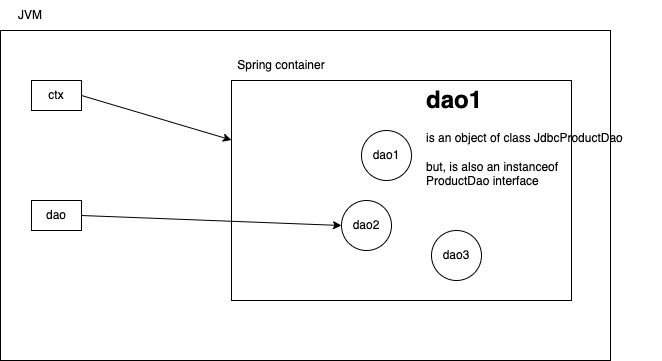

# Spring framework

- is a tool that helps developers build stable and large scale applications
- many ready-to-use software components that can simply be used in your projects
- more complex code is handled by spring, so we can focus on our business requirement
- spring has adopted many design patterns and good programming principles. so, by developing a spring framework, our application has already applied best practices
- this was developed by Rod Johnson in 2004
  - provided this as a lightweight replacement for (the then popular) J2EE technology
- address these kind of concerns by providing a layered approach:
  - different layers: presentation (client), service (business), dao (persistence), data store
  - data access
  - transaction management
  - MVC web application
  - Security

Core features of Spring framework:

- IOC (Inversion of control)
  - spring automatically (based on configuration) creates objects (service/dao/controller), manages their lifecycle, establishes the relationship between them (dependency injection)
- Spring data
  - simplifies database access by providing consistent and easy-to-use API over JDBC, Hibernate or JPA, in the form Template classes (JdbcTemplate, HibernateTemplate, etc)
    - these templates handle all the boilerplate code, and leaves us a minimal code
- Spring MVC
  - provides very simple configuration-first web application framework
- Security
  - offers robust, powerful authentication and authorization features
- Support for any 3rd party APIs

At very basic level, Spring is a factory of object (beans)

- Do not instantiate
  - let Spring give you an object (dependency injection)

Imagine you want an object of class A, which has dependency on objects of class B and C. And object of class C has dependency on objects of D, E and F.

You ask spring to give an object of class A, and spring will create all necessary objects required by A directly and indirectly, and give it to you.

```java
// with out spring
A a1 = new A(); // then you have to ensure that the members of A is assigned with.
a1.setB(new B())
C c1 = new C();
a1.setC(c1);
c1.setD(new D());
c1.setE(new E());
c1.setF(new F());

a1.doSomeBusiness();

// with spring
A a2 = context.getBean(A.class); // creates objects of A, B, C, D, E and F, and wires all the beans appropriately, and gives the reference of object A
a2.doSomeBusiness();
```

Scenario:

```plantuml

interface ProductDao{}

ProductDao <|.. JdbcProductDao
ProductDao <|.. HibernateProductDao
ProductDao <|.. MybatisProductDao


Application --> ProductDao: depends on

```

- `Application` uses the spring framework to obtain an object `ProductDao`.
- Spring is a container that contains objects (beans) of classes that are configured in either an XML file or an annotation based configuration class
- Spring container is represented using an object of interface `ApplicationContext`, which has many implementations: `ClassPathXmlApplicationContext`, `FileSystemXmlApplicationContext`, `AnnotationConfigApplicationContext` and few others.

```java
try(
    AnnotationConfigApplicationContext ctx =
        new AnnotationConfigApplicationContext(AppConfig.class)
){
    // now you can ask the container for any bean which is maintained in the container
    ProductDao dao = ctx.getBean(ProductDao.class);
    // all dependencies of "dao" is the responsibility of Spring
    // only criteria is that all dependencies are configured in the AppConfig class.

    // start using the dao.

}// ctx.close() called here

```



An example AppConfig class file

```java
public class AppConfig1 {
    @Bean
    public JdbcProductDao dao1(){
        log.trace("AppConfig1.dao1() called");
        JdbcProductDao dao = new JdbcProductDao();

        log.trace("returning an object of JdbcProductDao to the spring container");
        return dao;
    }
}
```

