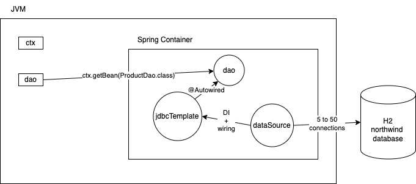

# Using JdbcTemplate

- A class by Spring that uses the Template design pattern
- Provide high level functions that takes care of all boilerplate code
  - open/ get a connection
  - create PreparedStatement
  - execute the statement
  - get the result
  - in case of the ResultSet, convert the rows into custom data types (String, Integer, Product etc)
  - return the result
  - or throw a uniform exception DataAccessException
  - commit or rollback
  - close all resources
- We have to take care of the statements that spring can not do
  - setting the PreparedStatement parameters
  - creating a custom entity object from a row of a ResultSet

