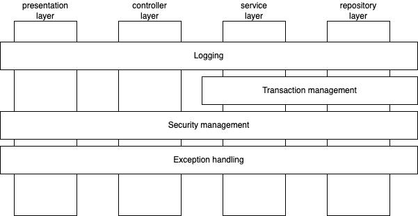
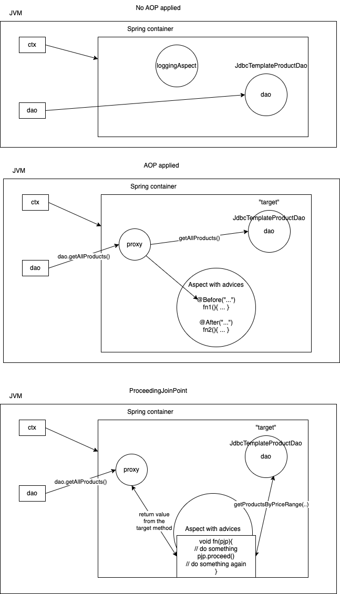

# AOP - Aspect Oriented Programming

- Programming paradigm that revolves around commonly appearing aspects in an application
- Addresses the cross-cutting concerns
  - An application is made up of different layers - presentation, controller, service, dao/repository, and others
  - lots of concerns (such as transaction management, logging, security, data transformation, exception handling) are there in every layer
    
  - this leads to
    - code scattering
    - code tangling

## Terminologies

### Aspect

    - a modularization of a concern that cuts across multiple classes.
    - Logging is a good example of a crosscutting concern in a Java application.
    - In Spring AOP, aspects are implemented using regular classes annotated with the @Aspect annotation

### Join point

    - a point during the execution of a program, such as the execution of a method or the handling of an exception.
    - In Spring AOP, a join point always represents a method execution.

### Advice

    - action taken by an aspect at a particular join point.
    - Different types of advice include "around," "before" and "after" advice.
    - Many AOP frameworks, including Spring, model an advice as an interceptor, maintaining a chain of interceptors around the join point.

### Pointcut

    - a predicate that matches join points.
    - Advice is associated with a pointcut expression and runs at any join point matched by the pointcut.
    - The concept of join points as matched by pointcut expressions is central to AOP
    - Spring uses the AspectJ pointcut expression language by default.

### Target object

    - object being advised by one or more aspects.
    - Also referred to as the advised object.
    - Since Spring AOP is implemented using runtime proxies, this object will always be a proxied object.

### AOP proxy

    - an object created by the AOP framework in order to implement the aspect contracts.
    - In the Spring Framework, an AOP proxy will be a JDK dynamic proxy or a CGLIB proxy.



### Types of advice:

- Before advice:

  - Advice that executes before a join point, but which does not have the ability to prevent execution flow proceeding to the join point (unless it throws an exception).

- After returning advice:

  - Advice to be executed after a join point completes normally
    - for example, if a method returns without throwing an exception.

- After throwing advice

  - Advice to be executed if a method exits by throwing an exception.

- After (finally) advice

  - Advice to be executed regardless of the means by which a join point exits (normal or exceptional return).

- Around advice
  - Advice that surrounds a join point such as a method invocation.
  - This is the most powerful kind of advice.
  - Around advice can perform custom behavior before and after the method invocation.
  - It is also responsible for choosing whether to proceed to the join point or to shortcut the advised method execution by returning its own return value or throwing an exception.

## AspectJ pointcut expression language

Syntax:

```aspectj
execution(modifiers-pattern? return-type-pattern declaring-type-pattern? name-pattern(param-pattern)
          throws-pattern?)
```
