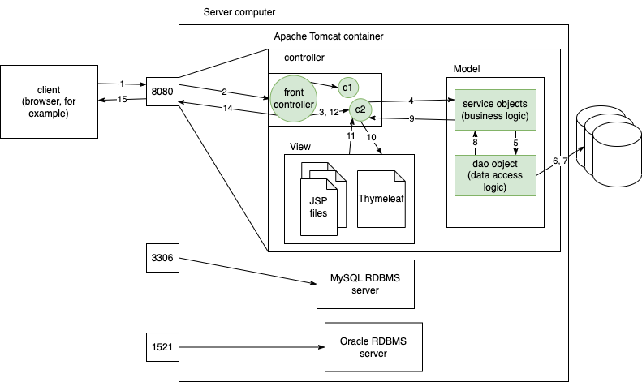

# Spring MVC

## MVC

- Model, View and Controller
- Emphasis on separation of concerns
- mostly applied on web applications



- Host OS exposes server applications (like MySQL, Oracle, Tomcat, WebLogic, etc) to the clients via ports
  - MySQL --> 3306
  - Oracle --> 1521
  - Tomcat --> 8080
  - WebLogic --> 7331
  - Typical production HTTP web server on the internet
    - HTTP --> 80
    - HTTPS --> 443
  - FTP --> 21
  - SSH --> 22
  - SMTP --> 25/587

```http
GET /api/products/info
Host: localhost:9999
accept: application/json
```

```http
GET /api/products/info
Host: localhost:9999
accept: text/plain
```
