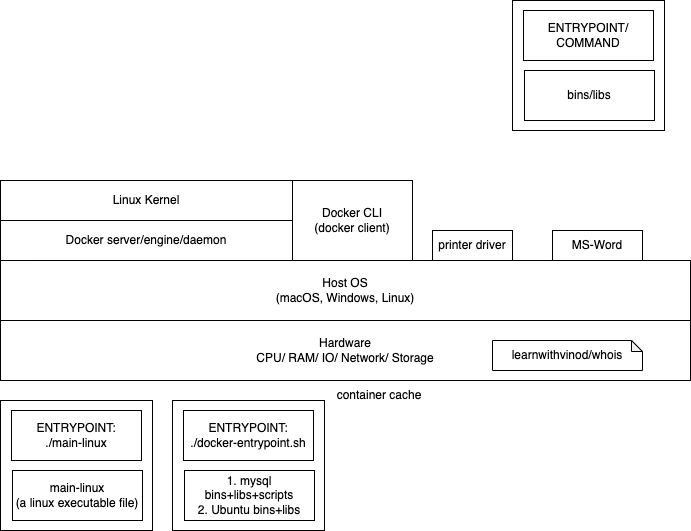

Steps to create a JAR file for our spring boot project

1. open a terminal in the project folder (pom.xml file's location)
1. issue this command: `mvn clean package -DskipTests`
1. verify the creation of the JAR file in the `./target` folder

To run the spring boot REST application

```sh
java -jar product-service-0.0.1-SNAPSHOT.jar

```

We can pass/override any spring boot application properties using the `-D` option

```sh
java -jar \
    -Dspring.datasource.driver-class-name=com.mysql.cj.jdbc.Driver \
    -Dspring.datasource.url=jdbc:mysql://localhost/northwind \
    product-service-0.0.1-SNAPSHOT.jar

```

Alternately, you can create a new `application.properties` file and override the existing property values or add new ones. Make sure that the file is in the same location as the JAR file.

# Docker

- open source
- a platform that allows the deployment, scaling, management of an application
- creates `containers` of everything you need for an application to be run
  - For example, following are the requirements to run the JAR file containing our REST service:
    - JRE (an appropriate version)
    - An OS suitable to run JRE
- provides a way to package an entire application with its dependencies (such as JDK, Python or OS etc) into a standardized unit called as an image (which when run, is called a container)

## Terminologies

1. Docker image:
   - readonly template for creating containers
     - think of like a disk image (.iso file) that contains an entire operating system
   - For example,
     - mysql server
     - postgresql server
   - contains application's code, runtime, system tools, and libraries
   - these images are created using a script file called as `dockerfile`
   - occupies disk space
1. Docker container:
   - a running process created out of an image (occupies memory and processed by CPU)
   - client applications can interact with a container
   - imagine a `mysql server` running being accessed by a java program
1. Docker engine/daemon/server
   - the core docker software that runs and communicates with the host os


