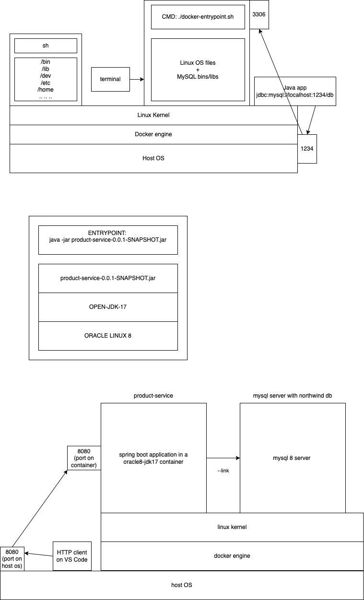

docker run -d -p 8080:8080 \
    -e DB_URL=jdbc:mysql://mysql8server/northwind \
    -e DB_DRIVER=com.mysql.cj.jdbc.Driver \
    --link mysql8server \
    --name ps \
    product-service:latest
    

# Microservices

- a.k.a. microservice architecture
- a large application can be built using smaller services

For example, we can develop a `order processing system dashboard` using a frontend application framework like Angular or React, but for the data, these software have to visit a server and get data in JSON format.

Solution 1: monolithic application at the backend
    - one single application handles all kinds of client requests
Solution 2: microservices approach
    - smaller services are easier to develop/manage
    - highly scalable 
    - testable 
    - independent development/maintenance
    - faster application development
    - allows us to use agile development 