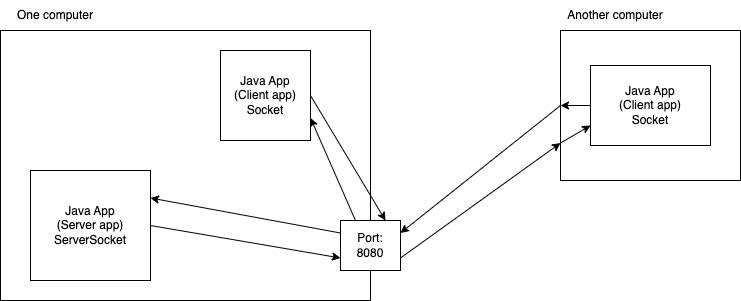

# Network (Socket) programming in Java

- Socket programming allows you to establish communication between two apps/devices over a network
  - uses sockets
- Using socket, client/server can exchange data

Types:

1. `java.net.ServerSocket`: used on the server side to listen to incoming client connections
1. `java.net.Socket`: used on the client side to establish a connection to the server

Both these sockets provide InputStream and OutputStream, using which we can read/write to the counterpart

## An exercise with socket programming

- The server provides some useful functions that a client can make use of
  - some very basic/dummy functions like factorial, power, sqrt etc
- The client app displays a menu to the user, and asks a choice for an operation (factorial/power/sqrt)
  - accepts the required parameters for the operations
  - sends the information required to invoke the corresponding function on the server
    - name of the function
    - arguments required for the function
  - let's send the information using a HashMap (which is serializable)
- The server reads the information sent by the client and accordingly executes one of the methods (factorial/power/sqrt)
  - sends the result/error using another HashMap
- The client should read this and display the same
- The Server should handle each client requests separately using threads
- The client will display the menu in a loop until the user decides to quit
